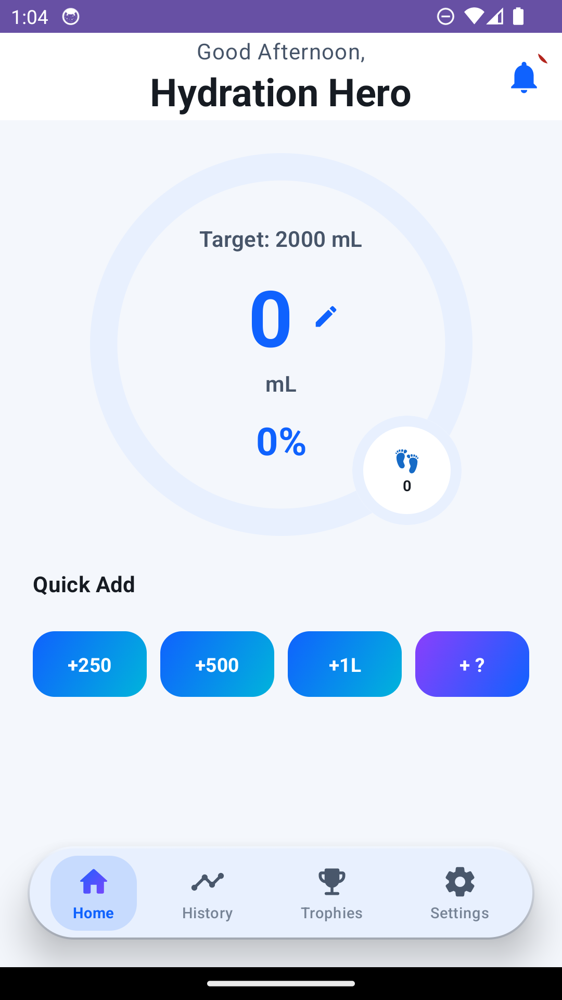
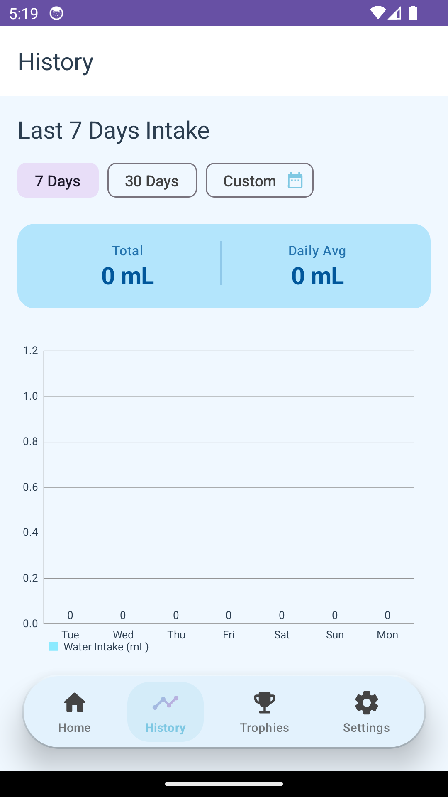
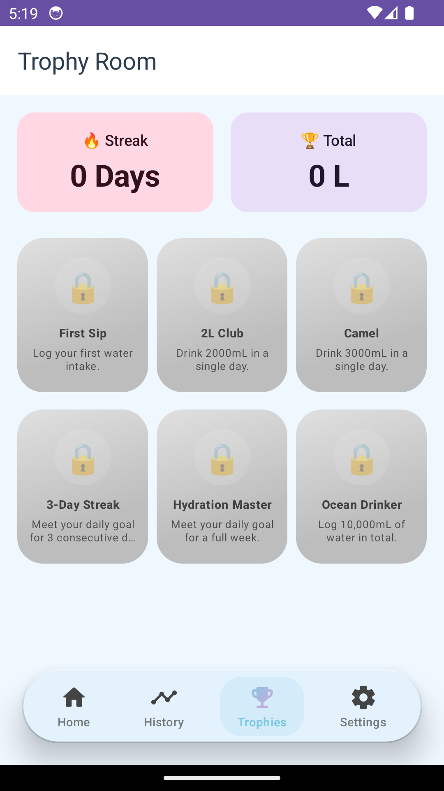
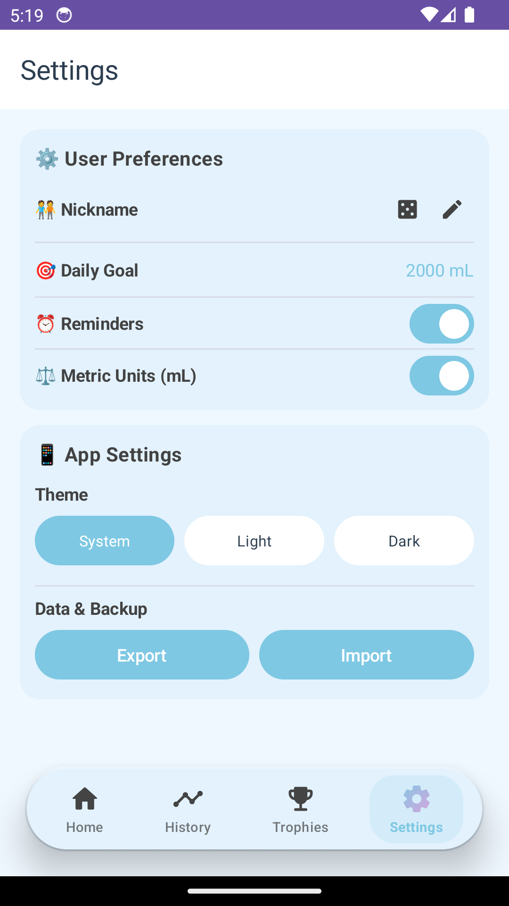
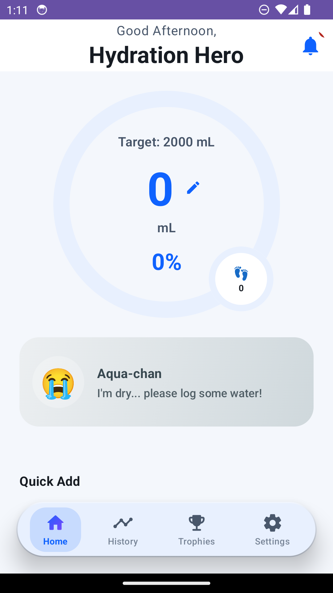
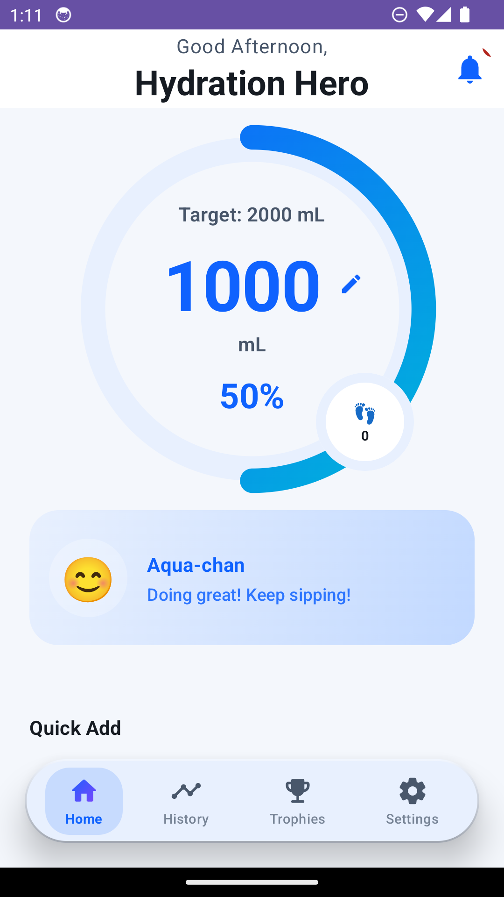
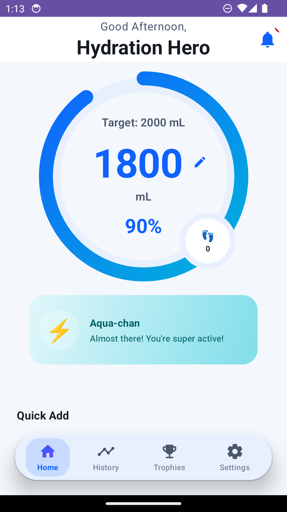
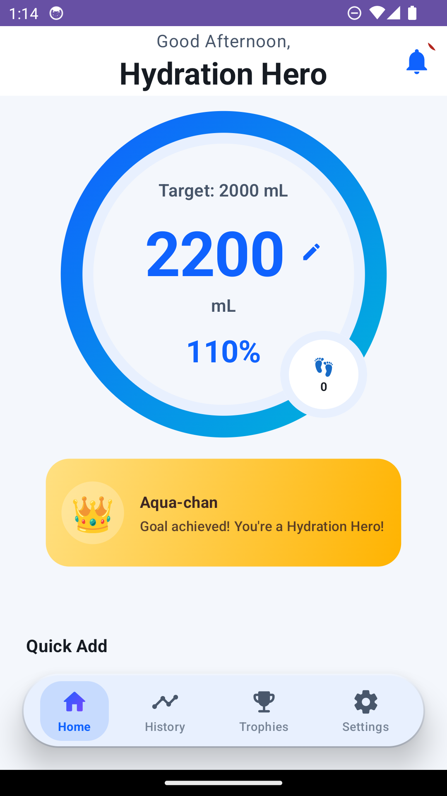

# 💧 ackwatraq

An Android app for tracking your daily water intake with premium gamification elements, featuring a stunning state-of-the-art modern visual identity.

## 📸 Screenshots

### App Screens
| Home Dashboard | History Analytics | Achievements Trophies | User Settings |
| :---: | :---: | :---: | :---: |
|  |  |  |  |

### 💧 Aqua-chan Mascot States
| Dehydrated (0% - 30%) | Healthy (31% - 79%) | Active (80% - 99%) | Fully Hydrated (100%+) |
| :---: | :---: | :---: | :---: |
|  |  |  |  |

## ✨ Key Features

- **Dynamic Hydration Mascot (Aqua-chan) 💧**: Meet Aqua-chan, your cute companion on the home dashboard! She reacts dynamically to your daily progress with shifting expressions (😭 ➜ 😊 ➜ ⚡ ➜ 👑), custom glassmorphic background colors, and helpful speech bubbles tailored to your current hydration state.
- **Figma Redesign Modernization**: Exquisite new theme featuring curated harmonious palettes, vibrant gradients, custom typography, and dynamic transitions.
- **Interactive 3D Bottom Bar**: Sleek, compact bottom navigation panel designed with customized 3D depth shadows and ambient glows covering labels for maximum tactile feel.
- **Quick-add Logging**: Easy 250mL, 500mL, 1L preset add buttons + custom volume input.
- **Goal Calculation**: Advanced goal estimations based on weight, activity levels, and custom preferences.
- **Achievements & Trophies**: Beautiful custom badge grids featuring unlock milestones (volumes, consistency streaks, and level ups).
- **History & Progress Insights**: Weekly statistics graphs and log charts showcasing complete hydration habits.
- **Reminders & Local Syncing**: Configurable notification scheduling, local-first architectures with Room DB and Datastore.

## 🛠️ Tech Stack

- **Language**: Kotlin
- **UI**: Jetpack Compose + Material Design 3
- **Storage**: Room Database + DataStore Preferences
- **Animations**: Custom Compose-native transitions and spring animations
- **Charts**: MPAndroidChart Integration
- **Architecture**: Clean MVVM (Model-View-ViewModel) + Repositories

## 🚀 Getting Started

1. Clone the repository:
   ```bash
   git clone https://github.com/ackwatraq/ackwatraq.git
   ```
2. Open the project in Android Studio (Hedgehog / Koala or newer).
3. Ensure Android SDK Platform 34 and Build Tools 30.0.3 are installed.
4. Build and run on a connected physical device or Android Virtual Device (AVD).

## 📁 Project Structure

```
app/src/main/java/com/ackwatraq/
├── data/
│   ├── db/          # Room entities, DAO, database
│   ├── repository/  # Data repositories
│   └── store/       # DataStore preferences
├── domain/
│   ├── model/       # Intake records, Achievement models
│   └── usecase/     # Goal logic & XP calculator
├── ui/
│   ├── home/        # Dashboard + quick-add logging UI
│   ├── history/     # Visual charts and stats logs
│   ├── achievements/# Gamification badges list
│   ├── settings/    # Goal settings & preferences
│   └── theme/       # Figma redesign typography & style tokens
└── worker/          # Notification alarms manager
```

## 📄 License

This project is licensed under the MIT License.

